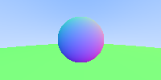
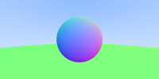
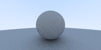

# Cgx

***CGX is a simple raycaster in Elixir***

## Below are the Rendered Images by CGX

### 1. Hello World
  

### 2. Lerp
    

### 3. Sphere
  

### 4. Normal
  

### 5. Multiple Objects
  

### 6. Antialiasing
  

### 7. Diffuse Materials
        